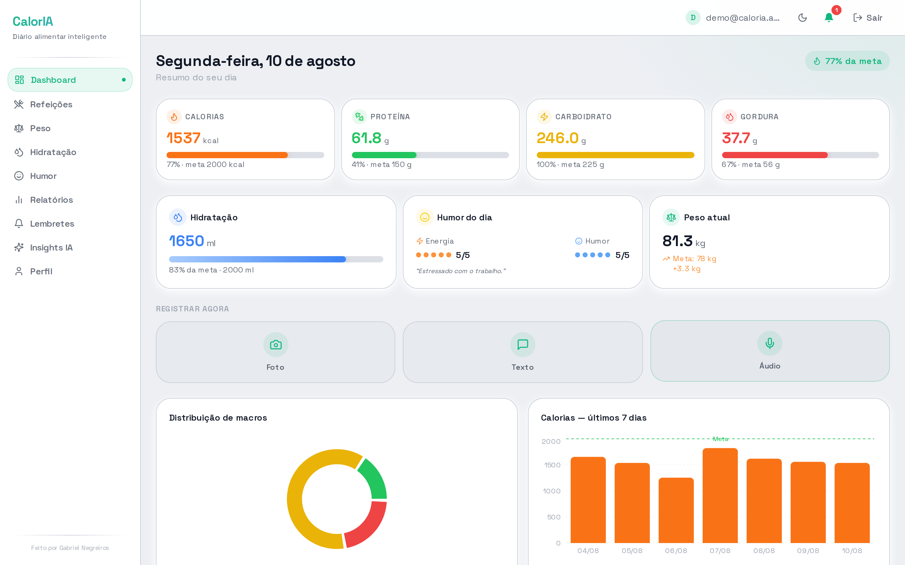
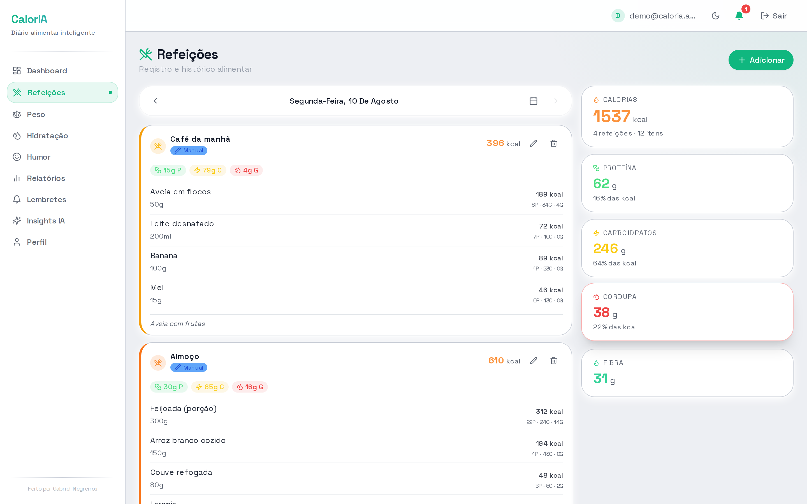
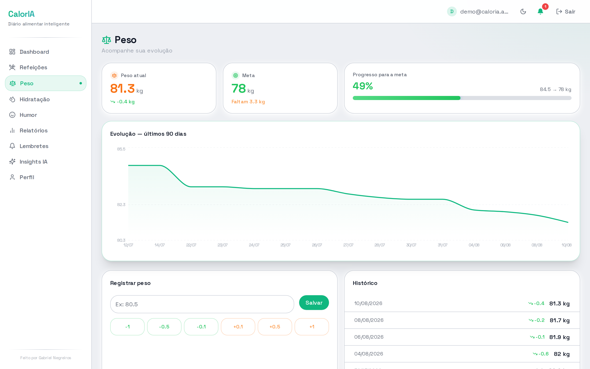
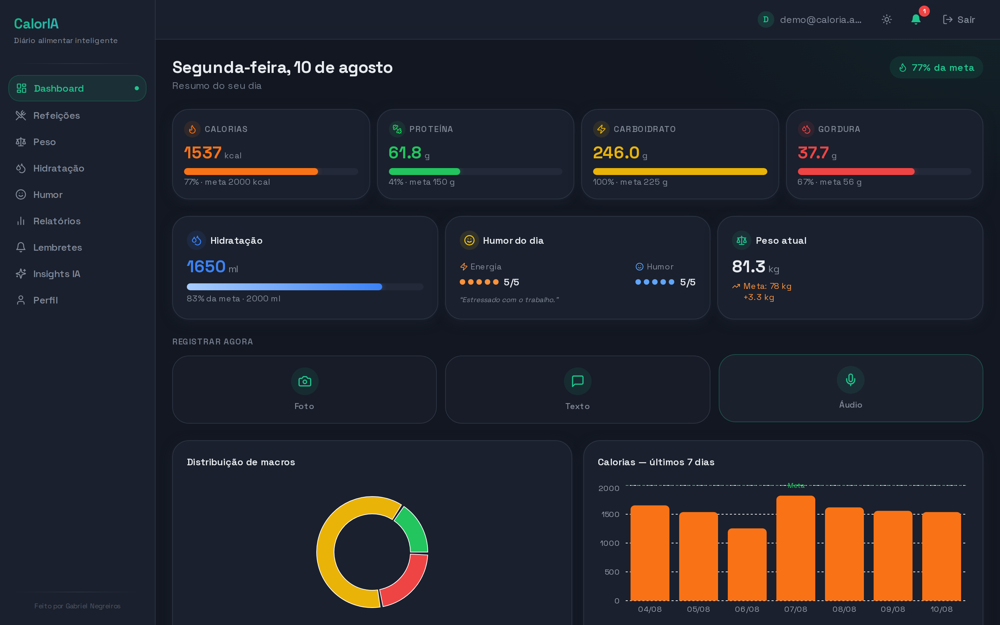
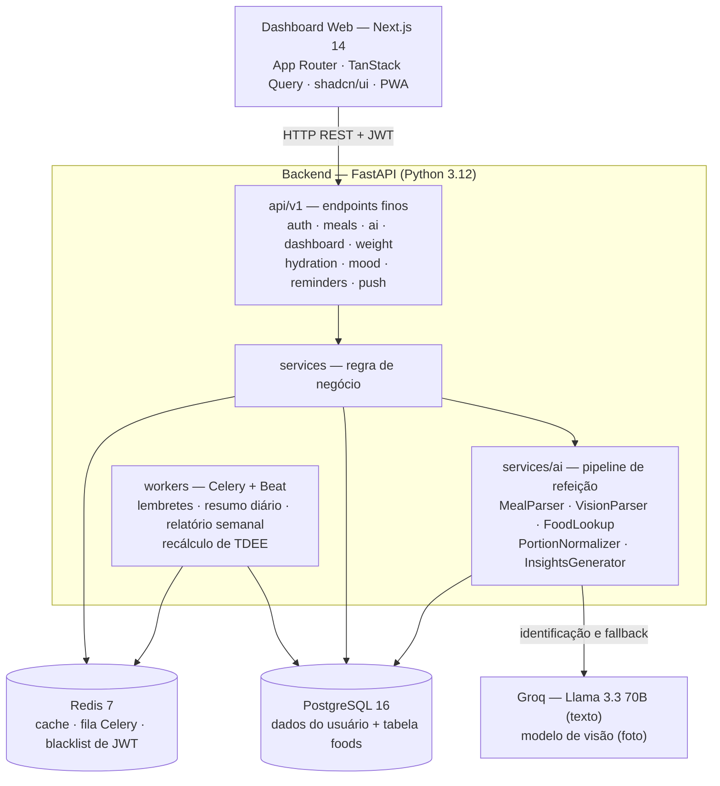
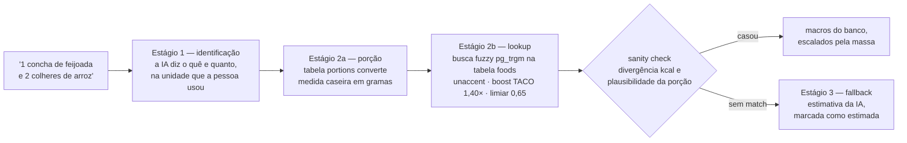

# CalorIA

Diário alimentar em que você descreve a refeição em português — *"1 concha de feijoada e 2 colheres de arroz"* — e a IA transforma isso em calorias e macronutrientes. Registro por texto ou foto, dashboard com histórico, peso, hidratação, humor e lembretes por Web Push.

[](https://github.com/gabriel-ngrs/CalorIA/actions/workflows/ci.yml)
[](LICENSE)
[](CHANGELOG.md)

**O que este repositório tem de diferente:** a pergunta *"como você sabe que uma mudança de prompt melhorou?"* tem resposta aqui — um harness de avaliação que mede o erro calórico do pipeline contra ground truth externo (IBGE POF + TACO), com prompts versionados por `sha256` e a série histórica versionada junto do código. Os números estão em [Decisões técnicas, com os números](#decisões-técnicas-com-os-números) e em [`backend/evals/`](backend/evals/README.md).

---

## Rodar em um comando

```bash
git clone https://github.com/gabriel-ngrs/CalorIA.git
cd CalorIA
make init
```

`make init` cria o `.env` a partir do `.env.example`, builda as imagens, sobe todos os serviços e aplica as migrações.

| Serviço | URL |
|---|---|
| Dashboard | http://localhost:3010 |
| API | http://localhost:8010 |
| Swagger | http://localhost:8010/docs |

Duas coisas dependem de você depois do primeiro `make init`:

1. **`GROQ_API_KEY` no `.env`** (gratuita em [console.groq.com/keys](https://console.groq.com/keys)) — sem ela o app sobe, mas a análise de refeição não funciona. Depois de preencher, `make down && make dev-d`.
2. **Banco nutricional** — a tabela `foods` nasce vazia. O dump está em `data/db/` e o procedimento de restauração, em [`data/README.md`](data/README.md). Sem ele todo alimento cai na estimativa da IA, que é o caminho menos preciso.

`make help` lista todos os alvos.

---

## Conta de demonstração

Para ver o dashboard com 30 dias de dados sem registrar nada à mão:

```bash
make seed-demo
```

| Campo | Valor |
|---|---|
| E-mail | `demo@caloria.app` |
| Senha | `CalorIADemo2026!` |

A conta traz refeições, evolução de peso, hidratação e humor dos últimos 30 dias.

**Estas credenciais são públicas de propósito.** Elas abrem **apenas** esta conta, que carrega dados sintéticos, não tem privilégio administrativo e não enxerga dados de nenhum outro usuário — a API deriva o `user_id` do token em toda rota autenticada. Não são reusadas em serviço nenhum.

**Reset.** `make seed-demo` é idempotente e é também o comando de reset: rodá-lo de novo devolve a conta ao estado publicado e apaga o que um visitante tenha registrado.

**Ainda não há demo hospedada.** A topologia oficial é host único e hoje roda localmente (ADR-009); publicar a instância é a Fase E.4 do plano em `.codeflow/specs/`. Enquanto isso, a demo é a de cima — local, em três comandos.

---

## Telas

| Dashboard | Refeições do dia |
|---|---|
|  |  |

| Evolução de peso | Tema escuro |
|---|---|
|  |  |

---

## Funcionalidades

- **Registro por texto ou foto** — a IA identifica os alimentos e a porção; o cálculo nutricional vem do banco, não do modelo
- **Origem de cada número declarada na tela** — item vindo da fonte curada, do banco geral ou estimado pela IA são visualmente distintos, e item sem âncora determinística de porção bloqueia o salvamento até confirmação
- **Dashboard** — calorias e macros do dia, distribuição, série de 7 dias, hidratação, humor e peso
- **Tracking de saúde** — peso, água, humor e energia, com gráficos por período
- **Insights** — análise de padrões, alertas de deficiência e ajuste de meta calórica (TDEE por Harris-Benedict)
- **Lembretes com Web Push** — notificações nativas no navegador e no celular, disparadas por Celery Beat
- **PWA** — instalável como app

---

## Arquitetura


```mermaid
flowchart TD
    WEB["Dashboard Web — Next.js 14<br/>App Router · TanStack Query · shadcn/ui · PWA"]
    WEB -->|HTTP REST + JWT| API

    subgraph BACK["Backend — FastAPI (Python 3.12)"]
        API["api/v1 — endpoints finos<br/>auth · meals · ai · dashboard · weight<br/>hydration · mood · reminders · push"]
        SERV["services — regra de negócio"]
        AI["services/ai — pipeline de refeição<br/>MealParser · VisionParser · FoodLookup<br/>PortionNormalizer · InsightsGenerator"]
        WORK["workers — Celery + Beat<br/>lembretes · resumo diário · relatório semanal<br/>recálculo de TDEE"]
        API --> SERV --> AI
    end

    AI -->|identificação e fallback| GROQ["Groq — Llama 3.3 70B (texto)<br/>modelo de visão (foto)"]
    SERV --> PG[("PostgreSQL 16<br/>dados do usuário + tabela foods")]
    AI --> PG
    WORK --> PG
    WORK --> REDIS[("Redis 7<br/>cache · fila Celery · blacklist de JWT")]
    SERV --> REDIS
```

Detalhes e ADRs em [`docs/architecture.md`](docs/architecture.md); os fluxos, com diagrama cada um, em [`docs/fluxos/`](docs/fluxos/README.md).

### O pipeline de refeição

O princípio, depois do reprojeto disparado pelo [bug 001](.codeflow/bugs/001-fluxo-cadastro-refeicao.md): **a IA identifica e normaliza; o banco calcula.**


```mermaid
flowchart LR
    TXT["'1 concha de feijoada<br/>e 2 colheres de arroz'"] --> ID["Estágio 1 — identificação<br/>a IA diz o quê e quanto,<br/>na unidade que a pessoa usou"]
    ID --> POR["Estágio 2a — porção<br/>tabela portions converte<br/>medida caseira em gramas"]
    POR --> LK["Estágio 2b — lookup<br/>busca fuzzy pg_trgm na tabela foods<br/>unaccent · boost TACO 1,40× · limiar 0,65"]
    LK --> SC{"sanity check<br/>divergência kcal e<br/>plausibilidade da porção"}
    SC -->|casou| DB["macros do banco,<br/>escalados pela massa"]
    SC -->|sem match| FB["Estágio 3 — fallback<br/>estimativa da IA,<br/>marcada como estimada"]
```

### Stack

| Camada | Tecnologia |
|---|---|
| API | Python 3.12 · FastAPI · Pydantic v2 |
| Dados | PostgreSQL 16 (pg_trgm) · SQLAlchemy 2 async · Alembic |
| Assíncrono | Celery + Celery Beat · Redis 7 |
| IA | Groq — `llama-3.3-70b-versatile` (texto) e modelo de visão (foto) |
| Frontend | Next.js 14 (App Router) · TypeScript · Tailwind · shadcn/ui · Recharts · TanStack Query |
| Notificações | Web Push VAPID (pywebpush) |
| Qualidade | ruff · mypy strict · pytest · ESLint · Jest · Playwright · gitleaks |
| Infra | Docker Compose · Caddy · GitHub Actions |

---

## Decisões técnicas, com os números

Cada linha tem fonte no repositório. Nenhum número aqui é estimativa de quem escreveu o README.

| Decisão | O que mudou | Fonte |
|---|---|---|
| **O prompt não força decomposição em ingredientes** | `"1 pizza grande 8 fatias de calabresa"` e `"8 fatias pizza calabresa"` davam 3386 e 2094 kcal — 38,2% de divergência, e ambos errados. A regra *"liste cada ingrediente separadamente"* impedia a IA de emitir `pizza calabresa`, que a fonte curada tem inteiro | [bug 001](.codeflow/bugs/001-fluxo-cadastro-refeicao.md) · [CHANGELOG](CHANGELOG.md) |
| **A divergência não era aleatoriedade do modelo** | Três execuções da mesma frase deram o mesmo resultado (572,3 kcal). O não-determinismo aparente vinha do pipeline aceitar a quantidade em gramas inventada pela IA, que variava com a frase | [bug 001](.codeflow/bugs/001-fluxo-cadastro-refeicao.md) |
| **Busca insensível a acento nos dois lados** | F1 do lookup **0,776 → 0,857** no conjunto rotulado de 40 consultas (0,829 na implementação final, com o boost). `similarity('feijao…','feijão…')` valia 0,75 em 43% das linhas TACO | [decision 2026-07-26](.codeflow/decisions/2026-07-26-limiares-lookup-nutricional.md) |
| **Excluir as 23.398 linhas `ai_estimated` do lookup** | Erro calórico médio **16,7% → 4,1%**; itens dentro de ±10% **69% → 91%**; erro máximo caiu pela metade. Custo aceito: 6 de 29 itens passam a cair no fallback, e chegam **marcados** como estimados | [decision 2026-07-26](.codeflow/decisions/2026-07-26-limiares-lookup-nutricional.md) |
| **Boost TACO de 1,40× e não de 2,50×** | 2,50 tem F1 melhor (0,889 vs 0,829) e foi rejeitado: passa a aceitar match de similaridade bruta 0,43, e `"arroz branco cozido"` casa com **`Brócolis cozido`**. Num diário alimentar, item errado é pior que item ausente | [decision 2026-07-26](.codeflow/decisions/2026-07-26-limiares-lookup-nutricional.md) |
| **Uma query com predicados indexáveis, não uma por n-grama** | `similarity(...) >= :min` não é indexável e levava a Seq Scan: **238 ms por n-grama**. Com `%>>` e `%` sobre índice GIN de expressão, o lookup completo mede **44 ms** | [CHANGELOG](CHANGELOG.md) · [fluxo 06](docs/fluxos/06-lookup-nutricional/fluxo.md) |
| **O sanity check não descarta match de fonte curada** | Em prato composto, o check de 35% descartava o dado bom e adotava a estimativa: MdAPE do estrato **23,81% → 6,86%**, itens dentro de ±10% **25% → 75%** | [decision 2026-08-02](.codeflow/decisions/2026-08-02-sanity-check-nao-descarta-fonte-curada.md) |
| **MdAPE como métrica headline, não MAPE** | O erro percentual é assimétrico por construção — subestimar tem teto de 100%, superestimar não tem. Usado como função objetivo, o MAPE seleciona prompts que subcontam calorias, que é o modo de falha danoso aqui. Macros em gramas vão em MAE com tolerância absoluta, nunca em percentual | [`backend/evals/README.md`](backend/evals/README.md) |

### Como sei se uma mudança de prompt melhorou

O harness em [`backend/evals/`](backend/evals/README.md) responde a isso com quatro peças:

- **Prompts versionados em arquivo**, com `name`, `version` e `sha256` travados por teste — editar o texto sem subir a versão quebra a suíte, e cada chamada registra a identidade do prompt no log.
- **Dataset com ground truth externo**: 43 casos (23 simples, 17 compostos, 3 de foto), medida caseira → gramas pela **IBGE POF 2011** e gramas → kcal/macros pela **TACO 4ª edição**. Nenhuma referência deriva da tabela `portions` do próprio projeto — o schema rejeita, para não medir o projeto contra si mesmo.
- **Camada rápida no CI**, por cassettes gravados: roda sem rede e falha se o payload enviado ao provedor mudar sem atualização do snapshot.
- **Camada completa semanal** contra o provedor real, com cada execução emitindo uma linha em `evals/runs/history.jsonl` que amarra métricas a commit, versão e `sha` de cada prompt, modelo, parâmetros de amostragem e `sha` do dataset.

**Linha de base medida** (commit `e1d39b0`, `llama-3.3-70b-versatile`, 43 casos, 57 chamadas, 42.932 tokens, mediana de 4,7 s por caso):

| Estrato | `n` | MdAPE | IC95 | Dentro de ±10% |
|---|---:|---:|---|---:|
| Simples | 23 | 25,53% | 7,83 – 33,33 | 34,8% |
| Composto | 16 | 61,64% | 43,66 – 89,94 | 6,2% |
| **Agregado** | **39** | **33,33%** | **26,26 – 43,66** | **23,1%** |

O agregado tem 39 dos 43 casos: os 3 do estrato de foto falharam com **HTTP 413** (o `max_tokens` reservado estoura o limite por minuto do free tier antes de a imagem chegar — [bug 003](.codeflow/bugs/003-http-413-no-estrato-de-foto.md)) e 1 caso composto não produziu número. **Nenhum número do estrato de foto vale como linha de base de produção enquanto o 413 existir.**

O gate do eval reprova nesta linha de base, e isso é o comportamento correto: os limiares foram calibrados sobre 10 casos-semente e o dataset real tem 43. Recalibrar é decisão com o número na mão, não ajuste de conveniência.

---

## Esteira de qualidade

| Gate | Onde roda |
|---|---|
| `ruff check` | pre-commit e CI |
| `ruff format --check` | pre-commit e `make check` |
| `mypy app/ evals/` em modo **strict** | CI e `make typecheck` |
| `pytest` com piso de cobertura bloqueante | CI |
| `gitleaks` com regras próprias (`.gitleaks.toml`) | pre-commit e CI |
| ESLint, Jest e `next build` | CI |
| Camada rápida do eval, sem rede | CI |

`make check` reproduz a maior parte dos gates do CI localmente — fora `gitleaks` e o `next build` de produção. A `main` é protegida: os dois checks são obrigatórios e valem também para administradores — ver [`docs/git-workflow.md`](docs/git-workflow.md).

---

## Estrutura do projeto

```
CalorIA/
├── backend/
│   ├── app/
│   │   ├── api/v1/         # endpoints finos
│   │   ├── core/           # config, segurança, DB, deps
│   │   ├── models/         # SQLAlchemy 2.x
│   │   ├── schemas/        # Pydantic v2
│   │   ├── prompts/        # prompts versionados (texto + sha256)
│   │   ├── services/       # regra de negócio; services/ai é o pipeline
│   │   └── workers/        # tarefas Celery
│   ├── evals/              # harness de avaliação da IA
│   ├── alembic/            # migrações
│   ├── scripts/            # seed, importação, instrumentação
│   └── tests/              # unit (sem infra) + integration
├── frontend/
│   ├── app/                # App Router
│   ├── components/         # UI e layout
│   └── lib/                # api client, hooks, utils
├── docs/                   # arquitetura, fluxos, setup, deploy, auditoria
├── data/                   # dumps e CSVs do banco nutricional
├── docker-compose.yml      # stack completa em host único  ← oficial (ADR-009)
├── docker-compose.dev.yml  # desenvolvimento, com hot reload
├── Caddyfile               # proxy HTTPS da stack completa  ← oficial (ADR-009)
└── Makefile                # make help lista tudo
```

---

## Desenvolvimento

```bash
make dev             # sobe tudo com hot reload
make check           # lint + typecheck + testes, igual ao CI
make test-unit       # testes unitários (não precisam de Postgres nem Redis)
make test-integration
make migrate         # alembic upgrade head
make psql            # console do banco
```

Guia de contribuição em [`CONTRIBUTING.md`](CONTRIBUTING.md).

---

## Deploy

A topologia oficial é **host único** (ADR-009): `docker compose up -d` sobe banco, cache, backend, frontend, workers e proxy no mesmo lugar. Hoje ela roda localmente; a mesma stack sobe numa VPS quando houver. O guia é [`docs/deploy.md`](docs/deploy.md).

O `ci.yml` roda a cada push na `dev` e em PR para `main`. O `cd.yml` está em disparo manual enquanto não há servidor — ver [`docs/git-workflow.md`](docs/git-workflow.md).

---

## Convenções de commit

Conventional Commits em português:

```bash
feat(frontend): adiciona análise de foto na página de refeições
fix(ai): corrige sanity check para alimentos com gordura alta
docs(readme): reescreve a seção de decisões técnicas
chore(deps): atualiza groq para 0.13
```

---

## Limites do free tier (Groq)

Dois limites medidos na prática, não lidos de tabela de preço:

| Limite | Valor medido | Como isso aparece no projeto |
|---|---|---|
| Tokens por minuto, modelo de visão | 8.000 | Os três casos de foto do eval falham com HTTP 413 pedindo ~11,4 mil tokens antes de a imagem chegar — o que estoura é o `max_tokens` reservado, não o tamanho da foto (bug 003) |
| Tokens por dia, conta inteira | 100.000 | Uma execução completa do eval consumiu 99.768 — daí a agenda do eval ser **semanal**, não diária |

O projeto mitiga com cache Redis por 7 dias (chave `sha256` incluindo o modelo), lookup local que evita chamar a IA para alimento comum, e retry por classe de exceção com teto de tempo.

---

## Documentação adicional

- [`docs/architecture.md`](docs/architecture.md) — ADRs 001 a 009
- [`docs/fluxos/`](docs/fluxos/README.md) — nove fluxos do sistema, com diagrama cada um
- [`backend/evals/README.md`](backend/evals/README.md) — o que o eval mede, o que não mede, e a análise de poder do desenho
- [`docs/setup.md`](docs/setup.md) — setup do zero, sem Docker
- [`docs/deploy.md`](docs/deploy.md) — deploy em host único
- [`docs/auditoria/relatorio-preliminar.md`](docs/auditoria/relatorio-preliminar.md) — auditoria de arquitetura, qualidade e segurança (57 achados, com plano priorizado)
- [`.codeflow/decisions/`](.codeflow/decisions/) — decisões de engenharia com a medição que as sustenta

---

## Licença

[MIT](LICENSE) — uso livre, com atribuição.
