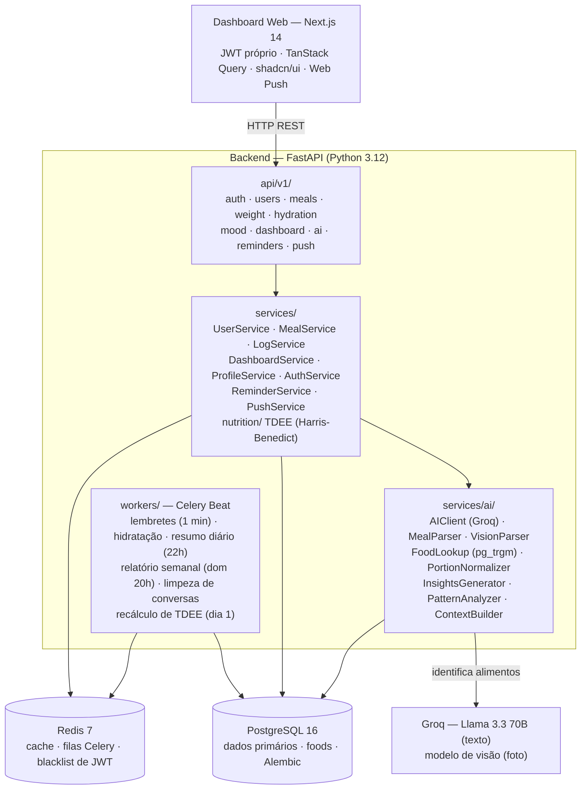

# Arquitetura — CalorIA

Decisões técnicas e ADRs do projeto CalorIA.

---

## Visão Geral



---

## ADR-001 — PostgreSQL para testes (não SQLite)

**Contexto:** O modelo `Reminder` usa `ARRAY(Integer)` do PostgreSQL para armazenar `days_of_week`.

**Decisão:** Usar um banco `caloria_test` no PostgreSQL local para testes de integração, em vez de SQLite.

**Consequências:**
- Requer PostgreSQL rodando no ambiente de CI/CD e de desenvolvimento
- Garante paridade total com o banco de produção
- Evita workarounds de tipo (ex.: `Text` simulando `ARRAY`)

---

## ADR-002 — Groq (Llama) como provedor de IA

**Contexto:** Inicialmente o projeto usava Google Gemini 2.5 Flash. Após a migração de v0.7, optamos pela Groq por oferecer um free tier mais generoso, latência menor e modelos Llama de ponta tanto para texto quanto para visão.

**Decisão:** Usar Groq como provedor único:
- Texto: `openai/gpt-oss-120b`
- Visão: `qwen/qwen3.6-27b`

Acessados pelo SDK oficial `groq` via classe `AIClient` (`services/ai/ai_client.py`).

**Revisão (2026-08-17) — modelo é configuração, não decisão de arquitetura.** Os
dois modelos Llama escolhidos aqui já foram aposentados pela Groq: o de visão em
2026-07 e `llama-3.3-70b-versatile` em 2026-08-17, cada um derrubando um caminho
de registro com 404 `model_not_found`. A decisão que sobrevive é *Groq como
provedor único*; o modelo específico vive em `GROQ_TEXT_MODEL` /
`GROQ_VISION_MODEL` e é trocável por `.env` + restart, sem deploy.

Consequência prática ao escolher um substituto: o modelo precisa devolver
`content` com JSON limpo. Modelos que expõem raciocínio **dentro** do conteúdo
(caso do `qwen`, que emite `<think>`) quebram o parse e exigem
`GROQ_VISION_REASONING=none`; `openai/gpt-oss-120b` põe o raciocínio em campo
`reasoning` separado e não sofre disso.

**Consequências:**
- Cache Redis (7 dias, chave SHA-256) reduz chamadas redundantes para insights
- Retry com backoff exponencial em erros 429 — até 4 tentativas, espera inicial 15s dobrada a cada tentativa
- Análise de fotos via bytes nativos — imagens não são armazenadas permanentemente
- `GROQ_API_KEY` nunca exposta ao frontend

---

## ADR-003 — Web Push VAPID em vez de bots externos

**Contexto:** O projeto inicialmente usava Telegram e WhatsApp (Evolution API) como canais de notificação. Isso criava dependência de serviços externos, sessões persistentes e infraestrutura adicional.

**Decisão:** Notificações via Web Push nativo (VAPID, pywebpush). Registro de refeições é exclusivamente via dashboard web.

**Consequências:**
- Sem Evolution API no Docker Compose
- Notificações nativas no browser desktop e mobile (PWA)
- Subscriptions armazenadas no banco (`push_subscriptions`); expiradas (HTTP 410) são removidas automaticamente
- Lembretes não têm mais campo `channel` — são sempre Web Push

---

## ADR-004 — Celery com Redis como broker (sem RabbitMQ)

**Contexto:** O projeto já usa Redis para cache e blacklist de JWT. Adicionar RabbitMQ seria over-engineering.

**Decisão:** Usar Redis como broker e backend do Celery.

**Consequências:**
- Menos serviços no Docker Compose
- Limitações de ack do Redis vs RabbitMQ (aceitáveis para uso pessoal)
- Beat schedule definido em código (`celery_app.py`), não em banco

---

## ADR-005 — JWT com blacklist em Redis

**Contexto:** JWT stateless não suporta logout nativo.

**Decisão:** Armazenar refresh tokens invalidados no Redis com TTL igual à validade do token.

**Consequências:**
- Logout real funciona
- Overhead mínimo: apenas refresh tokens são guardados na blacklist
- Access tokens de curta duração (30 min) não são blacklistados

---

## ADR-006 — Banco nutricional com pg_trgm + pipeline dois estágios + sanity check

**Contexto:** A IA estima macros com variância alta para alimentos brasileiros. Um pipeline de um único estágio misturava identificação e cálculo, dificultando validação e deixando registros incorretos do Open Food Facts contaminarem resultados.

**Decisão:** Banco `foods` no PostgreSQL (TACO ~307 + Open Food Facts ~19.500) com índice GIN trigrama. Pipeline em dois estágios com sanity check calórico:

1. **Estágio 1 — Identificação:** IA retorna alimentos com nome, quantidade, unidade e `kcal_estimate` (usado exclusivamente no sanity check, não substitui macros do banco).
2. **Estágio 2 — Lookup + sanity check:** Busca com `similarity()` + `%>>` (threshold 0.65). Se match encontrado, compara calorias calculadas do banco com `kcal_estimate` — divergência > 35% descarta o match e usa estimativa da IA (`data_source="ai_estimated"`). Itens sem match vão para `_estimate_macros_batch` (uma única chamada IA agrupada).

**Consequências:**
- Dados TACO recebem boost 1.40× para prevalecerem sobre Open Food Facts em desempates
- `MealItem` registra `food_id` (FK→foods) e `data_source` para rastreabilidade
- Sanity check evita que valores incorretos do Open Food Facts (ex: feijão carioca 40 kcal vs TACO 76 kcal) contaminem resultados
- Latência medida do lookup completo: **44 ms**, depois de a busca virar uma única query com predicados indexáveis (`docs/fluxos/06-lookup-nutricional/fluxo.md`)

---

## ADR-007 — Sistema de design Glassmorphism + Neumorphism

**Contexto:** shadcn/ui padrão tem visual genérico; o projeto precisava de identidade visual própria.

**Decisão:** Sistema de design com glassmorphism (backdrop-blur + transparência) combinado com neumorphism (sombras suaves). Implementado via CSS custom em `globals.css` (`@layer components`) e tokens no `tailwind.config.ts`.

**Consequências:**
- Classes utilitárias: `.glass`, `.glass-card`, `.glass-neu`, `.neu-raised`, `.neu-inset`, `.glow-primary`
- Dois temas, claro por padrão; a escolha vive em `localStorage` (`caloria-theme`) e é aplicada por script inline antes do primeiro paint, para não piscar
- Todos os módulos do dashboard seguem o mesmo sistema visual

---

## ADR-008 — CI/CD com GitHub Actions

**Contexto:** Deploy manual via SSH era propenso a erros e requeria acesso ao servidor a cada release.

**Decisão:** `ci.yml` roda lint + testes + build em todo push na `dev` e em PRs para `main`. `cd.yml` faz SSH → git pull → docker compose up → alembic ao mergear na `main`.

**Consequências:**
- `main` é sempre estável e deployável
- Deploy automático sem acesso manual ao servidor
- Secrets de SSH armazenados no GitHub Environment `production`
- Ver `docs/git-workflow.md` para o fluxo de branches
- **Estado atual:** o `ci.yml` roda como descrito; o `cd.yml` está em
  `workflow_dispatch` e implementa a topologia aposentada — ver as consequências do
  ADR-009 e a Fase E.4 da spec 002

---

## ADR-009 — Topologia self-hosted em host único

**Contexto:** o projeto acumulou **três** arquivos de compose e **dois** Caddyfiles, sem
que nenhum declarasse seu propósito, e a documentação descrevia como "produção" um par
que não era o que rodava. Havia duas topologias implícitas competindo:

| topologia | arquivos | frontend | estado |
|---|---|---|---|
| **A — host único** | `docker-compose.yml` + `Caddyfile` | no mesmo host | documentada como "Produção" |
| **B — dividida** | `docker-compose.backend.yml` + `Caddyfile.backend` | na Vercel | a que de fato rodava |

A auditoria da Fase E.1 (2026-08-02) mediu o estado real e **refutou a premissa da
documentação**: o backend não estava "indeterminado", estava inexistente — o host
`caloria-gabriel.duckdns.org` não resolve sequer em DNS. O frontend na Vercel continua
no ar, com build de ~13 dias, servindo uma tela de login sem API atrás.

O `Caddyfile.backend` deixa a topologia B evidente: ele publica apenas `/api`, `/docs` e
`/redoc` — a cara de um host que existe só para servir a API.

**Decisão:** a topologia oficial é a **A — self-hosted em host único**:
`docker-compose.yml` + `Caddyfile`, subindo Postgres, Redis, backend, frontend, os dois
workers Celery e o proxy no mesmo lugar.

Decisão do owner em 2026-08-03, com duas condições temporais explícitas:

- **Agora:** roda **localmente**. Não há servidor contratado e não haverá deploy nesta
  spec — a Fase E.4 fica adiada por decisão, não por impedimento.
- **Futuro:** o mesmo par sobe numa VPS quando houver. Nada na topologia muda; muda o
  host.

O par da topologia B (`docker-compose.backend.yml` + `Caddyfile.backend`) **não é
deletado aqui**: recebe cabeçalho declarando que é legado e fica marcado para a poda da
Fase D.4. O escopo desta fase é desambiguar, não remover.

**Justificativa:** um host único é a forma mais simples de um projeto pessoal ter uma
stack reprodutível — `docker compose up` e está tudo de pé, incluindo o frontend, sem
depender de plataforma externa nem de dois lugares para configurar. A topologia dividida
paga o preço de coordenar dois ambientes (variáveis de API, CORS, dois deploys) em troca
de um CDN gratuito, e esse preço só se justifica com tráfego que este projeto não tem.

**Consequências:**
- `docker-compose.yml` passa a ser a stack de produção **e** o jeito de rodar o projeto
  inteiro localmente. O README deixa de chamá-lo de "Produção" sem qualificação.
- O deploy na **Vercel fica órfão**: continua no ar apontando para uma API que não
  existe. Retirá-lo (ou reapontá-lo) é ação do owner, registrada como pendência na Fase
  E.4 — deixar uma tela de login quebrada acessível é o oposto do objetivo de vitrine
  desta spec.
- `docs/deploy.md` vira o **único** guia de deploy; `docs/deploy-checklist.md` foi
  incorporado a ele. Dois documentos descrevendo o mesmo procedimento foi como o host
  errado acabou registrado em quatro lugares.
- O `cd.yml` do ADR-008 continua válido **como desenho de pipeline** (SSH, `concurrency`,
  migração antes de subir), mas **implementa a topologia aposentada**: seu passo de
  deploy sobe `docker-compose.backend.yml` (`cd.yml:38`). Trocá-lo por
  `docker-compose.yml` é trabalho da **Fase E.4**, que já é dona da reativação do
  gatilho. Enquanto isso ele está inerte — o `push: branches: [main]` segue comentado e
  só resta `workflow_dispatch`, de modo que nem a promoção da D.2 dispara deploy.
  **Consequência para a Fase D.4:** o `docker-compose.backend.yml` só pode ser removido
  na poda **depois** que a E.4 corrigir essa referência; removê-lo antes quebra o CD por
  um caminho difícil de associar à poda.

---

## Fluxo de Registro de Refeição (Web)

```
Usuário envia descrição ou foto no dashboard
        │
        ▼
  POST /api/v1/ai/analyze-meal  (texto)
  POST /api/v1/ai/analyze-photo (foto)
        │
        ▼
  ContextBuilder
  ├── infere tipo de refeição (café/almoço/janta/lanche)
  ├── busca últimas 3 refeições do mesmo tipo
  └── injeta porções históricas e médias diárias
        │
        ▼
  [Estágio 1] Groq Llama identifica alimentos
  └── retorna: food_name, quantity, unit, preparation, kcal_estimate
        │
        ▼
  [Estágio 2] FoodLookup (pg_trgm, threshold 0.65) + sanity check
  ├── match + divergência ≤ 35%  → macros do banco, data_source=food.source
  ├── match + divergência > 35%  → fallback estimativa IA
  └── sem match                  → _estimate_macros_batch (IA agrupada)
                                   data_source="ai_estimated"
        │
        ▼
  _correct_calories (Atwater: prot×4 + carb×4 + gord×9)
        │
        ▼
  Retorna MealAnalysisResponse ao frontend
        │
   Usuário confirma
        │
        ▼
  POST /api/v1/meals → salva no banco
```

---

## Estrutura de Banco de Dados

```
users (1)
  ├── user_profiles (1:1)
  ├── meals (1:N)
  │     └── meal_items (1:N) — food_id FK→foods, data_source, micronutrientes
  ├── weight_logs (1:N)
  ├── hydration_logs (1:N)
  ├── mood_logs (1:N)
  ├── reminders (1:N)
  ├── push_subscriptions (1:N)
  ├── notifications (1:N)
  └── ai_conversations (1:N)

foods — banco nutricional unificado (TACO + Open Food Facts)
  └── search_text GIN index (pg_trgm)
```

Todas as relações usam `CASCADE DELETE`.

---

## Segurança

- Senhas com passlib[bcrypt]
- JWT HS256 — access (30 min) + refresh (30 dias)
- CORS configurável via `BACKEND_CORS_ORIGINS`
- `GROQ_API_KEY` nunca exposta ao frontend
- Variáveis sensíveis em `.env` (nunca commitado)
