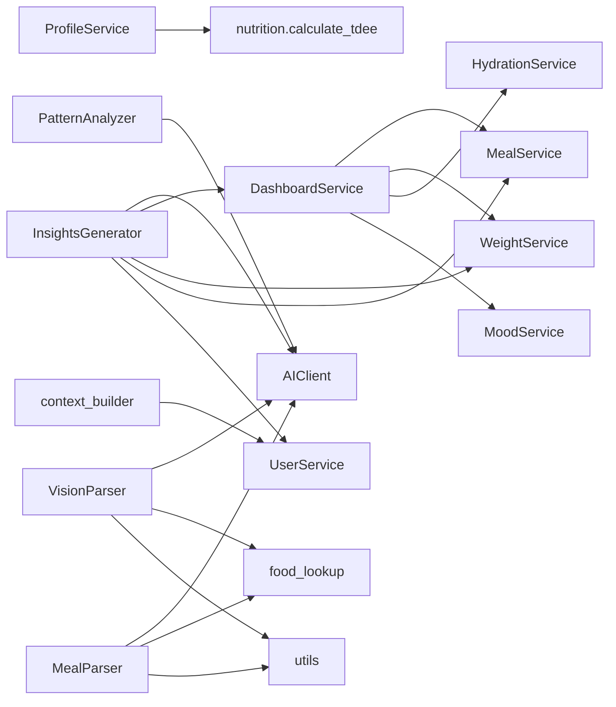

# Frente A — Arquitetura

**Plano:** ver `plano.md` § Frente A.

## Achados desta frente

- AUD-001 (🟡 média) — `backend/app/api/v1/push.py` faz queries SQL diretamente no router (sem camada de service)
- AUD-002 (🟡 média) — `services/ai/insights_generator.py` 512 LOC com 7 responsabilidades distintas — candidato a quebra

## A.1 Separação de camadas

Comando: `rg -n "(select|insert|update|delete)\(" backend/app/api/v1/`. Artefato: `artefatos/A1-queries-em-routers.txt`.

Após filtrar falsos positivos (`@router.delete(...)` é decorator HTTP, não SQL; `ReminderService(...).delete(...)` é método de service), restam **6 violações reais**, todas em `backend/app/api/v1/push.py`:

| Endpoint | Linha | Operação SQL inline |
|---|---|---|
| `POST /push/subscribe` | 80–101 | `select(PushSubscription)` + upsert manual + `db.commit()` |
| `DELETE /push/unsubscribe` | 112–118 | `delete(PushSubscription).where(...)` + `db.commit()` |
| `GET /notifications` | 134–139 | `select(Notification)...order_by().limit()` |
| `GET /notifications/unread-count` | 151–157 | `select(func.count(...))` |
| `PATCH /notifications/{id}/read` | 170–184 | `select` + mutação + `db.commit()` + `db.refresh()` |
| `POST /notifications/read-all` | 195–199 | `update(Notification)...values(read=True)` |

Demais routers (`meals.py`, `reminders.py`, etc.) delegam para services — `push.py` é o único outlier.

## A.2 Filtragem por user_id

Comando: ver `artefatos/A2-user-id-coverage.txt` (508 linhas brutas) + análise endpoint-a-endpoint via script Python (`re.finditer` para extrair blocos de cada `@router.*`).

**Endpoints (47 totais)**

Apenas 4 não usam `Depends(get_current_user_id)` — todos públicos por design:

| Endpoint | Justificativa |
|---|---|
| `POST /auth/register` | Cria usuário; ainda não existe sessão |
| `POST /auth/login` | Autentica por email/senha |
| `POST /auth/refresh` | Usa refresh token, não JWT |
| `GET /push/vapid-public-key` | Chave pública para clientes; sem dado pessoal |

Os outros 43 endpoints injetam `user_id` e o aplicam em queries/services. Nenhum suspeito.

**Queries em services / workers (sem `user_id` direto)**

| Query | Local | Filtra por user_id? | Justificativa |
|---|---|---|---|
| `select(Meal).where(Meal.id == meal.id)` | `meal_service.py:67` | ❌ direto, ✅ indireto | Refresh após `create_meal()`; `meal` recém-criado é do usuário; só re-hidrata com `selectinload(items)` |
| `select(User)` (lookup) | `user_service.py:19/26/58` | N/A | Próprio `User`; lookup de auth (id/email) |
| `select(UserProfile).where(...)` | `profile_service.py:17` | ✅ | filtra `user_id` |
| `select(User).where(User.is_active.is_(True))` | `workers/.../*.py` | N/A | Tarefa batch/scheduler, itera todos os usuários ativos por design; queries-filhas usam `user.id` da iteração |
| `select(PushSubscription).where(user_id==user.id)` | `workers/tasks/reminders.py`, `reports.py` | ✅ | escopo por usuário iterado |
| `select(WeightLog).where(user_id==user.id)` | `workers/tasks/maintenance.py:88` | ✅ | escopo por usuário iterado |

Todas as queries de `log_service.py`, `meal_service.py` (exceto refresh acima), `reminder_service.py`, `pattern_analyzer.py` e `context_builder.py` filtram explicitamente por `user_id`. Nenhuma violação encontrada.

## A.3 Cascades e ForeignKeys

Comando: `rg -n "relationship\(|ForeignKey\(" backend/app/models/`. Artefato: `artefatos/A3-relacionamentos.txt`.

| Pai → Filho | FK `ondelete=` | ORM `cascade=` | Coerência |
|---|---|---|---|
| User → UserProfile | `CASCADE` | `all, delete-orphan` (uselist=False) | ✅ posse |
| User → Meal | `CASCADE` | `all, delete-orphan` | ✅ posse |
| User → WeightLog | `CASCADE` | `all, delete-orphan` | ✅ posse |
| User → HydrationLog | `CASCADE` | `all, delete-orphan` | ✅ posse |
| User → MoodLog | `CASCADE` | `all, delete-orphan` | ✅ posse |
| User → Reminder | `CASCADE` | `all, delete-orphan` | ✅ posse |
| User → AIConversation | `CASCADE` | `all, delete-orphan` | ✅ posse |
| User → PushSubscription | `CASCADE` | `all, delete-orphan` | ✅ posse |
| User → Notification | `CASCADE` | `all, delete-orphan` | ✅ posse |
| Meal → MealItem | `CASCADE` | `all, delete-orphan` | ✅ posse (item é parte da refeição) |
| MealItem → Food | `SET NULL` (`nullable=True`) | (sem ORM relationship) | ✅ referencial — apaga `Food` mantém histórico do `MealItem` como snapshot |

Observações:
- Padrão consistente em **todos** os relacionamentos: ORM `cascade` + DB `ondelete` espelhados, evitando órfãos no DB caso alguém apague via SQL puro.
- `MealItem.food_id` referencia `foods.id` mas **não** define `relationship("Food", ...)` — intencional (o `MealItem` carrega snapshot denormalizado de `food_name`/`calories`/`protein`/etc., para preservar o registro mesmo se o `Food` for removido).
- `UserProfile.user_id` tem `unique=True` (1:1).

Nenhum achado.

## A.4 Responsabilidades dos services

Extração via AST (`ast.parse` + caminhada na árvore para coletar classes e métodos públicos).

| Service | LOC | Classe(s) principal(is) | Métodos públicos | Risco |
|---|---|---|---|---|
| `auth_service.py` | 40 | (módulo) | `blacklist_token`, `is_token_blacklisted` | OK |
| `dashboard_service.py` | 68 | `DashboardService` | `get_today`, `get_weekly` | OK |
| `log_service.py` | 144 | `WeightService`, `HydrationService`, `MoodService` | 3 + 3 + 3 = 9 métodos divididos por classe | OK (3 responsabilidades em 3 classes coesas) |
| `meal_service.py` | 166 | `MealService` (+ exc `MealItemNotFound`) | `list_meals`, `create_meal`, `get_meal`, `update_meal`, `delete_meal_item`, `delete_meal`, `get_macros_by_date_range`, `get_daily_summary` | OK (CRUD + 2 agregações; coesivo) |
| `profile_service.py` | 48 | `ProfileService` | `get_profile`, `update_profile` | OK |
| `push_service.py` | 51 | (módulo) | `send_push_notification_sync` | OK |
| `reminder_service.py` | 82 | `ReminderService` | `list`, `create`, `create_many`, `delete`, `toggle` | OK |
| `user_service.py` | 61 | `UserService` | `get_by_id`, `get_by_email`, `create`, `authenticate`, `email_exists` | OK |
| `ai/ai_client.py` | 158 | `AIClient` | `generate_text`, `generate_with_image` | OK |
| `ai/context_builder.py` | 313 | (módulo) | `build_meal_context` | OK (313 LOC vêm de helpers privados; só 1 entrada pública) |
| `ai/food_lookup.py` | 173 | `IdentifiedFood` (+ funcs) | (apenas helpers) | OK |
| `ai/insights_generator.py` | **512** | `InsightsGenerator` | `daily_insight`, `weekly_insight`, `answer_question`, `suggest_meal`, `nutritional_alerts`, `goal_adjustment_suggestion`, `monthly_report` | ⚠️ **>300 LOC + 7 responsabilidades** → AUD-002 |
| `ai/meal_parser.py` | 274 | `MealParser` | `parse` | OK |
| `ai/pattern_analyzer.py` | 180 | `PatternAnalyzer` | `analyze_eating_patterns` | OK |
| `ai/utils.py` | 39 | (módulo) | `extract_json_from_ai_response`, `correct_calories` | OK |
| `ai/vision_parser.py` | 281 | `VisionParser` | `parse_base64` | OK |
| `nutrition/tdee.py` | 28 | (módulo) | `calculate_tdee` | OK |

Adicionado: AUD-002 (🟡 média) — `InsightsGenerator` com 7 responsabilidades distintas em 512 LOC.

## A.5 Dependências entre services

Comando: `rg -n "from app\.services" backend/app/services/`. Artefato: `artefatos/A5-dep-services.txt`.

**Análise**

- Grafo é **DAG** — nenhum ciclo (`MealService`, `WeightService`, `HydrationService`, `MoodService`, `AIClient`, `food_lookup`, `utils`, `UserService` não importam outros services).
- `InsightsGenerator` tem **fan-out 5** (mais alto do projeto): consome `AIClient`, `DashboardService`, `WeightService`, `MealService`, `UserService`. Reforça AUD-002 (alta cohesão + alto acoplamento sugere quebra).
- `DashboardService` é orquestrador legítimo de leitura (fan-out 4 sobre serviços de log/refeição).
- Camada `ai/*` depende apenas de `AIClient`, `food_lookup`, `utils` (e `UserService` em `context_builder`) — boa separação.

Nenhum achado adicional (ciclo).

## Notas e contexto

(texto livre conforme aprendizagens surgem)
