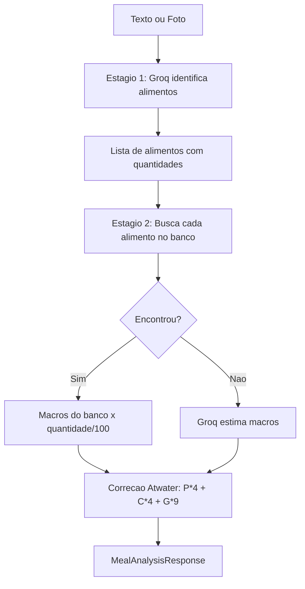

# Fluxo de Analise de IA (Pipeline de 3 Estagios)

## Visao Geral

O princípio do pipeline, depois do reprojeto do bug 001, é:
**a IA identifica e normaliza; o banco calcula.**

Tanto o `MealParser` (texto) quanto o `VisionParser` (foto) seguem os mesmos estagios:

1. **Estagio 1 — Identificacao:** a IA diz *o que* foi comido e *quanto*, na unidade que a pessoa usou. Não calcula valor nutricional.
2. **Estagio 2 — Normalizacao de porcao + lookup:** o código converte a porção caseira em gramas pela tabela `portions` e busca o alimento no banco.
3. **Estagio 3 — Fallback:** só os itens sem correspondência no banco vão para uma estimativa da IA, e chegam ao usuário **marcados como estimados**.

---

## Diagrama

---

## 1. Estagio 1 — Identificacao (Texto)

1. `MealParser.parse()` recebe descricao + contexto + db
2. `ContextBuilder.build_meal_context()` monta 5 secoes de contexto (ver seção 6)
3. Envia para IA com `_IDENTIFY_SYSTEM_PROMPT`, cujas regras centrais são:
   - **Prato conhecido vem inteiro.** Se a descrição nomeia um prato brasileiro
     reconhecível (pizza de calabresa, feijoada, lasanha, strogonoff, moqueca,
     baião de dois, yakissoba, hot dog, parmegiana), devolve UM item com o nome
     do prato. A decomposição em ingredientes é o fallback, não a regra.
   - **Quantidade na unidade do usuário.** `"8 fatias"` → `quantity=8, unit="fatia"`.
     A IA **não** converte para gramas.
   - `preparation` só quando informa preparo real; nunca `"não aplicável"`.
   - `kcal_estimate` é sinal auxiliar de checagem, não o valor final.
4. IA retorna: `[{food_name, quantity, unit, preparation, confidence, kcal_estimate}]`

### Por que o prompt mudou

A regra antiga era *"Liste CADA ingrediente separadamente, mesmo em pratos
compostos"*. Ela **impedia o banco de ser usado**: a fonte curada `taco` tem
`Pizza calabresa` (270 kcal/100g), mas a IA nunca emitia esse nome — emitia
"massa de pizza", "calabresa", "queijo mussarela" — e o lookup nunca tinha
chance de casar o prato.

Pior: cada frase produzia uma decomposição diferente. `"1 pizza grande 8 fatias"`
virava 800 g de massa; `"8 fatias pizza calabresa"` virava 400 g. Era daí que
saía a divergência de 38,2% da reprodução oficial do bug 001.

---

## 2. Estagio 1 — Identificacao (Foto)

1. `VisionParser.parse_base64()` recebe imagem em base64 + contexto + db
2. Envia para o modelo multimodal com prompt de calibracao visual
3. O modelo identifica alimentos e estima porcoes
4. Retorna o mesmo formato JSON do fluxo de texto

**Modelo configurável.** `GROQ_VISION_MODEL` e `GROQ_TEXT_MODEL` vêm da
configuração. Antes eram constantes de módulo, e quando a Groq descontinuou o
modelo de visão a análise por foto passou a responder 404 `model_not_found` sem
forma de trocar sem novo deploy.

**Raciocínio desligado.** Modelos que expõem raciocínio gastam o orçamento de
tokens escrevendo o bloco `<think>` e truncam antes do JSON. A chamada envia
`reasoning_effort` (config `GROQ_VISION_REASONING`), repetindo sem o parâmetro
se o modelo não o aceitar. O extrator de JSON também tolera blocos de raciocínio
e texto solto em volta do array.

---

## 3. Estagio 2 — Normalizacao de porcao e lookup

Para cada `IdentifiedFood` do estagio 1:

1. **Normaliza a porção** com `PortionNormalizer.normalizar(nome, quantidade, unidade)`:
   - `g`/`kg`/`mg` passam direto; `ml`/`l` convertem por densidade de líquido aquoso;
   - unidade caseira consulta a tabela `portions` (`8 fatia` de pizza → 800 g);
   - aceita número, fração (`1/2`) e extenso (`dois`, `meia`);
   - sem regra aplicável, o item fica marcado como **não-ancorado**.
2. **Limpa a consulta**: `preparation` só entra quando informa algo.
   `"azeite não aplicável"` pontuava 0,6364 (abaixo do limiar 0,65) enquanto
   `"azeite"` pontua 1,00.
3. Chama `lookup_food(query, db)` — ver `docs/fluxos/06-lookup-nutricional`.
4. Com match, escala os macros pela massa **normalizada**: `calories = cal_100g × gramas/100`.
5. Sem match, o item vai para o Estagio 3.

### Dois sanity checks, não um

| check | o que compara | o que pega |
|---|---|---|
| divergência calórica | `db_kcal` contra `kcal_estimate` da IA (tolerância 35%) | linha errada do banco |
| **plausibilidade da porção** | massa contra a faixa `grams_min`/`grams_max` | **erro de porção** |

O segundo existe porque o primeiro é cego onde importa: quando a IA erra a
quantidade, `db_kcal` e `kcal_estimate` **erram juntos** e a divergência não
acusa nada. Um item que falha a plausibilidade não é descartado — é marcado
com `needs_review`, e o front exige confirmação antes de salvar.

---

## 4. Estagio 3 — Fallback e pos-processamento

- Recebe as quantidades **já normalizadas em gramas**, então mesmo o caminho
  estimado herda a âncora determinística de porção.
- **Uma saída garantida por entrada.** Antes, `zip(..., strict=False)` casava por
  posição e descartava alimentos em silêncio quando a IA devolvia um array menor
  — a refeição perdia itens sem que ninguém soubesse. O que faltar vira item
  marcado para revisão.
- **Correção de Atwater** (`correct_calories`): recalcula as calorias pelos macros
  quando divergem mais de 10% — e também quando a IA **omite** `calories`, caso
  em que o item era gravado com 0 kcal e sumia do total do dia.
- **Análise vazia é rejeitada.** Zero itens levanta erro legível em vez de virar
  uma refeição fantasma de 0 kcal salvável.

### Flag de baixa confianca

`low_confidence = true` quando algum item tem `confidence < 0.6` **ou**
`needs_review`. O front destaca esses itens e bloqueia o salvamento até
confirmação.

---

## 5. Transparencia da origem do dado

Cada `ParsedFoodItem` carrega de onde o número veio:

| campo | conteúdo |
|---|---|
| `data_source` | `taco` \| `openfoodfacts` \| `usda` \| `fatsecret` \| `ai_estimated` |
| `matched_food_name` | nome do alimento casado no banco |
| `portion_text` | a porção como a pessoa escreveu (`"8 fatia"`) |
| `portion_source` | `direta` \| `volume` \| `tabela` \| `sem_ancora` |
| `needs_review` / `review_reason` | por que o item precisa de confirmação |

Esses campos são **persistidos** no `MealItem` ao salvar (`data_source`,
`food_id`, micronutrientes, e a porção original em `raw_input`) — antes eram
descartados no `POST /meals`, e a refeição gravada não sabia mais explicar de
onde tinha vindo o número.

---

## 6. Contexto do Usuario (5 secoes)

| Secao | Conteudo | Fonte |
|-------|----------|-------|
| Perfil e metas | Meta calorica, sexo, idade, altura, peso | `users` + `profiles` |
| Consumo de hoje | Calorias e proteinas ja consumidas | `meals` + `meal_items` |
| Porcoes historicas | Top 15 alimentos (30 dias) com medias | `meal_items` |
| Refeicoes recentes | Ultimas 3 do mesmo tipo | `meals` |
| Media por tipo | Calorias medias por tipo (30 dias) | `meals` |

---

## 7. AIClient (Groq) — Cache e Retry

- **Cache:** SHA256 do prompt → Redis com TTL de 7 dias
- **Analise de refeicao:** sempre `use_cache=False` (cada refeicao e unica)
- **Retry:** exponencial (15 s, 30 s, 60 s) para 429
- **404 de modelo** não é repetido: levanta erro acionável apontando a config

---

## 8. Precisao medida

| métrica | como medir |
|---|---|
| erro calórico do caminho determinístico | `python scripts/eval_golden_set.py` — 30 refeições brasileiras. Medido em 2026-07-26: **4,1%** de erro médio, 91,3% dentro de ±10% |
| divergência entre descrições equivalentes | `python scripts/instrument_meal_pipeline.py` — a repro do bug 001 saiu de 38,2% para **0,0%** |
| estratégia e limiares do lookup | `python scripts/eval_food_lookup.py` |

---

## Arquivos-chave

| Arquivo | Responsabilidade |
|---------|------------------|
| `services/ai/meal_parser.py` | Parser de texto — identificacao, normalizacao, lookup, fallback |
| `services/ai/vision_parser.py` | Parser de foto — mesmo pipeline |
| `services/ai/food_lookup.py` | Busca no banco de alimentos |
| `services/nutrition/portions.py` | Conversao determinística de porcao caseira em gramas |
| `services/ai/context_builder.py` | Monta contexto personalizado |
| `services/ai/ai_client.py` | Cliente Groq com cache, retry e modelos configuraveis |
| `services/ai/utils.py` | `extract_json_from_ai_response()`, `correct_calories()`, Atwater |
| `scripts/eval_golden_set.py` | Conjunto dourado — precisao calorica |
| `scripts/instrument_meal_pipeline.py` | Instrumentacao ANTES/DEPOIS do pipeline |
