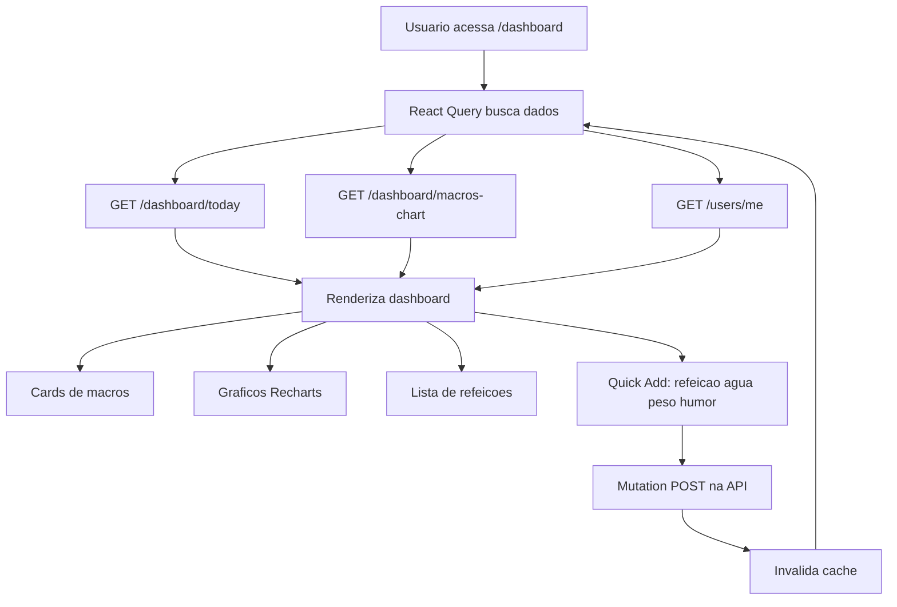

# Fluxo do Dashboard e Frontend

## Visao Geral

O frontend e uma PWA construida com Next.js 14 (App Router), Tailwind CSS, shadcn/ui e React Query. Usa NextAuth para autenticacao.

---

## Diagrama

---

## 1. Estrutura de Navegacao

- `/login` e `/register` — paginas de autenticacao
- `/dashboard` — pagina principal com resumo do dia
- `/meals` — lista de refeicoes com filtros
- `/insights` — insights e relatorios IA
- `/perfil` — perfil do usuario
- `/configuracoes` — configuracoes e lembretes

Todas as rotas dentro de `(dashboard)` exigem autenticacao.

---

## 2. Carregamento do Dashboard

1. Componente monta e dispara hooks em paralelo:
   - `useDashboardToday()` → `GET /api/v1/dashboard/today`
   - `useMacrosChart(7)` → `GET /api/v1/dashboard/macros-chart?days=7`
   - `useMe()` → `GET /api/v1/users/me`
2. React Query gerencia cache e loading states
3. Renderiza:
   - Cards de macros com progress bars (calorias, proteina, carbs, gordura)
   - Grafico de pizza com distribuicao de macros (Recharts)
   - Lista de refeicoes do dia por tipo
   - Progresso de hidratacao
   - Humor/energia do dia

---

## 3. Data Fetching (React Query)

- **Cache fresco:** retorna imediatamente
- **Cache stale:** retorna cache + refetch em background
- **Sem cache:** fetch da API
- **Invalidacao:** apos mutacoes (create/update/delete), invalida queries relacionadas

**Deduplicacao de requests:** React Query deduplicaa chamadas identicas automaticamente.

---

## 4. Pagina de Refeicoes (`/meals`)

1. Lista refeicoes com filtros por data e tipo
2. Cada card mostra itens com macros
3. Acoes: editar, excluir
4. Botao "Nova Refeicao" abre modal de analise
5. Modal aceita texto ou foto → analisa com IA → salva

---

## 5. PWA (Progressive Web App)

- **Service Worker:** registrado em `/sw.js`
- **Manifest:** nome "CalorIA", start_url `/dashboard`, display standalone
- **Push notifications:** via Web Push API
- **Instalavel:** icone na home screen, modo fullscreen

---

## 6. Componentes Principais

| Componente | Descricao |
|------------|-----------|
| `Sidebar` | Navegacao lateral |
| `Header` | Usuario, notificacoes |
| `MacroCards` | Cards de progresso de macros |
| `MacroChart` | Grafico de pizza (Recharts) |
| `MealList` | Lista de refeicoes |
| `HydrationProgress` | Barra de progresso de agua |
| `QuickAddModals` | Modais rapidos (refeicao, agua, peso, humor) |
| `PushSubscriber` | Gerencia inscricao push |

---

## Arquivos-chave

| Arquivo | Responsabilidade |
|---------|------------------|
| `frontend/app/(dashboard)/dashboard/page.tsx` | Pagina principal |
| `frontend/app/(dashboard)/meals/page.tsx` | Lista de refeicoes |
| `frontend/app/(dashboard)/insights/page.tsx` | Insights e relatorios |
| `frontend/lib/api.ts` | Cliente HTTP com interceptors |
| `frontend/lib/hooks/useDashboard.ts` | Hooks de dados do dashboard |
| `frontend/lib/hooks/useMeals.ts` | Hooks de refeicoes e analise |
| `frontend/lib/hooks/useAI.ts` | Hooks de insights |
| `frontend/lib/hooks/usePushNotifications.ts` | Hook de push |
| `frontend/components/dashboard/` | Componentes do dashboard |
| `frontend/public/sw.js` | Service Worker |
| `frontend/app/manifest.ts` | PWA manifest |
